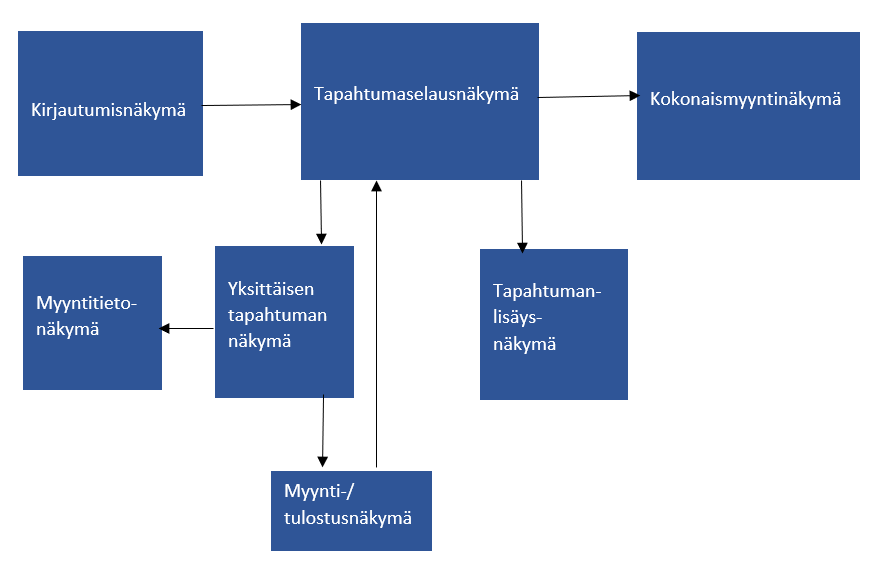
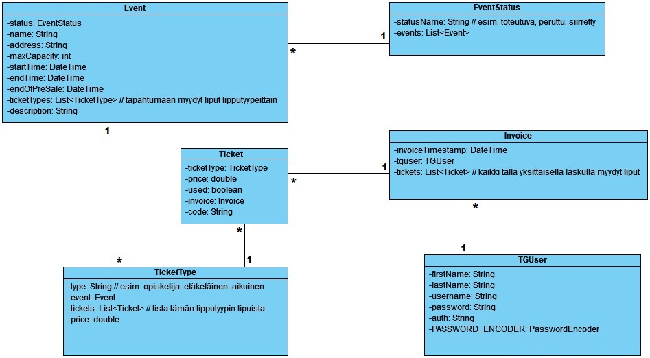

# TicketGuru

Tiimi: Heta Björklund, Jerri Mäkilä, Heli Saarinen, Riitta Väisänen.

## Johdanto

Projektin aihe on TicketGuru-nimisen lipunmyyntijärjestelmän backend.

Asiakas on lipputoimisto, joka tarvitsee lipunmyyntijärjestelmän lippujen myymiseen myyntipisteessään. Lipputoimisto määrittelee tapahtumat, joihin lippuja myydään, ja montako lippua tapahtumaan voidaan myydä. Tapahtumakoordinaattori lisää tapahtumat järjestelmään ja myyjä myy lipunmyyntipisteessä lippuja asiakkaalle. Jokaisessa lipussa on yksilöllinen koodi lipuntarkastamista varten. Myöhemmässä vaiheessa järjestelmään lisätään verkkokauppa, josta asiakkaat voivat itse ostaa lippuja.

Projektin päättyessä valmiina tulee olemaan REST-rajapinta, tietokanta ja yksinkertainen käyttöliittymä. Kehittämisvaiheessa käytettävä tietokantajärjestelmä on H2 ja lopullisessa projektissa PostgreSQL. Projekti julkaistaan Herokussa. Lipunmyyntijärjestelmä toimii web-sovelluksena selaimella.

## Järjestelmän määrittely

Alla kuvattuna järjestelmän tarpeet tarkemmin käyttäjäroolien sekä käyttäjätarinoiden kautta.

### Käyttäjäroolit

Järjestelmällä on tässä kehitysvaiheessa kaksi roolia: myyjä sekä tapahtumakoordinaattori.

#### Myyjä

* Myy ja tulostaa lippuja asiakkaille
* Tulostaa ennakkomyynnin jälkeen jäljellä olevat liput ovella myytäviksi

#### Tapahtumakoordinaattori

* Hallinnoi tapahtumia ja lipputyyppejä 
* Lisää uusia tapahtumia ja muuttaa tapahtumien tietoja tarvittaessa

### Tulevat roolit

Siinä vaiheessa, kun TicketGurusta lähdetään kehittämään verkkokauppaa, tarvitsemme luonnollisesti lisää rooleja, jotta toiminta olisi mahdollisimman sujuvaa.

#### Asiakas

* Asiakas tekee ostoksia lippukaupassa

#### Tapahtumajärjestäjä

* Muokkaa tapahtuman tietoja tarvittaessa
* Seuraa tapahtumiensa lipunmyyntitilannetta

### Käyttäjätarinat

#### **Myyjätarinat (M)**
M1 Myyjänä haluan kirjautua sisään järjestelmään, jotta voin myydä lippuja.

M2 Myyjänä haluan tietää kuinka monta lippua tapahtumassa on kokonaisuudessaan,
jotta tiedän, montako lippua voin myydä. 

M3 Myyjänä haluan tietää, mitä lipputuotteita hintoineen tapahtumaan kuuluu, 
jotta voin veloittaa asiakasta oikein. 

M4 Myyjänä haluan pystyä kuittaamaan lipun nopeasti ovella käytetyksi (lipuntarkastus), jotta jono 
etenee. 

M5 Myyjänä haluan pystyä luomaan loput tapahtuman liput ovella myytäviksi lipuiksi tapahtuman ennakkomyynnin päätyttyä yhdellä kertaa. 

M6 Myyjänä haluan nähdä listauksen tulevista tapahtumista, jotta voin kertoa asiakkaalle millaisia tapahtumia on tulossa.

M7 Myyjänä haluan nähdä, onko tapahtumaan lippuja vielä myytävissä, jotta en myy "ylipaikkoja".

M8 Myyjänä haluan kyetä lisäämään usean tapahtuman lippuja myytäväksi samalla laskulla, jotta otta jokaista lippua ei tarvitse myydä yksittäin ja voin samalla transaktiolla myydä ne asiakkaalle.

M9 Myyjänä haluan saada tulostettua myymäni liput, jotta voin antaa ne asiakkaalle.

#### **Tapahtumakoordinaattoritarinat (TK)**

TK1 Tapahtumakoordinaattorina haluan kirjautua sisään järjestelmään, jotta voin lisätä tapahtumia ja lippuja.

TK2 Tapahtumakoordinaattorina haluan voida lisätä tapahtuman, jotta tapahtumaan voi lisätä lippuja myyntiin.

TK3 Tapahtumakoordinaattorina haluan voida lisätä tapahtuman lipputyypit hintoineen, jotta tapahtuman lippuja voi myydä.

TK4 Tapahtumakoordinaattorina haluan nähdä ajantasaisen raportin tapahtuman myydyistä ja 
myymättömättömistä lipuista, jotta voin seurata myynnin etenemistä. 

TK5 Tapahtumakoordinaattorina haluan nähdä listauksen kaikista tapahtumista haluamaltani aikaväliltä, jotta tiedän, miten paljon töitä myyjillä on.

TK6 Tapahtumakoordinaattorina haluan kyetä tekemään muutoksia tapahtumiin, jotta ohjelmassa oleva tieto ja tuotteet ovat ajantasaisia

TK7 Tapahtumakoordinaattorina haluan voida perua tapahtuman esimerkiksi esiintyjän peruessa.

TK8 Tapahtumakoordinaattorina haluan saada listauksen peruttuun tapahtumaan myydyistä lipuista, jotta tiedän mitkä liput on hyvitettävä asiakkaille.

TK9 Tapahtumakoordinaattorina haluan voida muuttaa tapahtuman lippujen hintoja lisäämällä mahdollisia alennuksia ja kampanjatarjouksia.

TK10 Tapahtumakoordinaattorina haluan kyetä ottamaan vapaana olevia lippuja pois myynnistä, voidakseni toimia mm. koronasäädösten tai tapahtuman ylläpitäjän toiveiden mukaan.

## Käyttöliittymäkaavio

## Luokkakaavio

## Tietohakemisto

> ### _Event_
> _Event-taulu sisältää tapahtuman tiedot._
>
> Kenttä | Tyyppi | Kuvaus
> ------ | ------ | ------
> id | bigint PK | Tapahtuman id
> address | varchar | Tapahtumapaikan osoite
> description | text | Lyhyt kuvaus tapahtumasta ja sen esiintyjistä
> end_of_presale | timestamp | Tapahtuman ennakkomyynnin loppu (pvm ja kellonaika)
> end_time | timestamp | Tapahtuman loppuaika (pvm ja kellonaika)
> max_capacity | int | Tapahtuman maksimipaikkamäärä
> name | varchar | Tapahtuman nimi
> start_time | timestamp | Tapahtuman alkuaika (pvm ja kellonaika)
> status_id | bigint | Tapahtuman status, viittaus [EventStatus](#EventStatus)-tauluun

> ### _EventStatus_
> _EventStatus-taulu sisältää tapahtuman statuksen: onko se toteutuva, peruttu tai siirretty._
>
> Kenttä | Tyyppi | Kuvaus
> ------ | ------ | ------
> id | bigint PK | Tapahtuman statuksen id
> status_name | varchar | Tapahtuman status

>### _Invoice_
>_Invoice-taulu käsittää yksittäisen myyntitapahtuman. Jokaisella myyntitapahtumalla (invoice) on aina vain yksi myyjä (TGUser). Jokaisella myyntitapahtumalla voi olla useampi lippu (ticket)._
>
>Kenttä | Tyyppi | Kuvaus
>------ | ------ | ------
>id | bigint PK | Laskun id
>invoice_timestamp | timestamp | Laskun luomisen aikamerkintä
>tguser_id | bigint FK | Laskun luonut myyjä, viittaus käyttäjään [TGUser](#TGUser)-taulussa

>### _TGUser_
>_TGUser-taulu kuvaa yksittäistä myyjää. Myyjä liittyy useampaan myyntitapahtumaan (invoice)._
>
>Kenttä | Tyyppi | Kuvaus
>------ | ------ | ------
>id | bigint PK | Käyttäjän id
>auth | varchar | Käyttöoikeustaso
>first_name | varchar | Etunimi
>last_name | varchar | Sukunimi
>password | varchar | Suolattu salasana
>user_name | varchar | Käyttäjänimi

> ### _Ticket_
> _Ticket-taulu sisältää lipun tiedot._
>
> Kenttä | Tyyppi | Kuvaus
> ------ | ------ | ------
> id | bigint PK | Lipun id
> price | real | Lipun hinta
> used | boolean | Lipun status, onko lippu käytetty vai ei
> invoice_id | bigint FK | Laskun tunnus jolla lippu on myyty, viittaus [Invoice](#Invoice)-tauluun
> ticket_type_id | bigint FK | Lipputyypin tunnus, viittaus [TicketType](#TicketType)-tauluun

>### _TicketType_
>_TicketType-taulu kuvastaa lipun tyyppiä. Lipputyypit määritetään kullekkin tapahtumalle erikseen, ja kullekkin lipputyypille määritetään oma hinta._
>
>Kenttä | Tyyppi | Kuvaus
>------ | ------ | ------
>id | bigint PK | Lipputyypin id
>price | real | Lipputyypin hinta
>type | varchar | Tarkempi kuvaus lipun tyypistä (esim. opiskelija, eläkeläinen, lapsi)
>event_id | bigint FK | Tapahtuman tunnus johon lipputyyppi liittyy, viittaus tapahtumaan [Event](#Event)-taulussa

## Tekninen kuvaus

Projektissa on kolme haaraa: master, postgreSQL_local ja postgreSQL_heroku.

### Master
- master-haara on kehityshaara.
- Tietokanta on H2. Tietokanta ei ole persistentti, vaan tiedot häviävät kun sovellus sammutetaan.
- Sovelluksen paikallinen osoite on localhost:8080/
- Endpointit ovat muotoa localhost:8080/events

### PostgreSQL_local
- postgreSQL_local-haara on testaushaara.
- Tietokanta on PostgreSQL. Tietokanta on persistentti, mutta sinne pääsee käsiksi vain paikallisesti.
- Sovelluksen paikallinen osoite on localhost:5432/
- Endpointit ovat muotoa localhost:5432/events

### PostgreSQL_heroku
- postgreSQL_heroku-haara on projektin tuotantohaara ja julkaistu versio Herokussa.
- Tietokanta on PostgreSQL. Tietokanta on persistentti ja sinne pääsee käsiksi internetin kautta.
- Sovelluksen osoite on https://ticketguru-2021.herokuapp.com/
- Herokun etärepositorio löytyy osoitteesta https://git.heroku.com/ticketguru-2021.git
- Endpointit ovat muotoa https://ticketguru-2021.herokuapp.com/events

## Testaus

Tässä kohdin selvitetään, miten ohjelmiston oikea toiminta varmistetaan
testaamalla projektin aikana: millaisia testauksia tehdään ja missä vaiheessa.
Testauksen tarkemmat sisällöt ja testisuoritusten tulosten raportit kirjataan
erillisiin dokumentteihin.

Tänne kirjataan myös lopuksi järjestelmän tunnetut ongelmat, joita ei ole korjattu.

## Asennustiedot

Järjestelmän asennus on syytä dokumentoida kahdesta näkökulmasta:

-   järjestelmän kehitysympäristö: miten järjestelmän kehitysympäristön saisi
    rakennettua johonkin toiseen koneeseen

-   järjestelmän asentaminen tuotantoympäristöön: miten järjestelmän saisi
    asennettua johonkin uuteen ympäristöön.

Asennusohjeesta tulisi ainakin käydä ilmi, miten käytettävä tietokanta ja
käyttäjät tulee ohjelmistoa asentaessa määritellä (käytettävä tietokanta,
käyttäjätunnus, salasana, tietokannan luonti yms.).

## Käynnistys- ja käyttöohje

Tyypillisesti tässä riittää kertoa ohjelman käynnistykseen tarvittava URL sekä
mahdolliset kirjautumiseen tarvittavat tunnukset. Jos järjestelmän
käynnistämiseen tai käyttöön liittyy joitain muita toimenpiteitä tai toimintajärjestykseen liittyviä asioita, nekin kerrotaan tässä yhteydessä.

Usko tai älä, tulet tarvitsemaan tätä itsekin, kun tauon jälkeen palaat
järjestelmän pariin !
