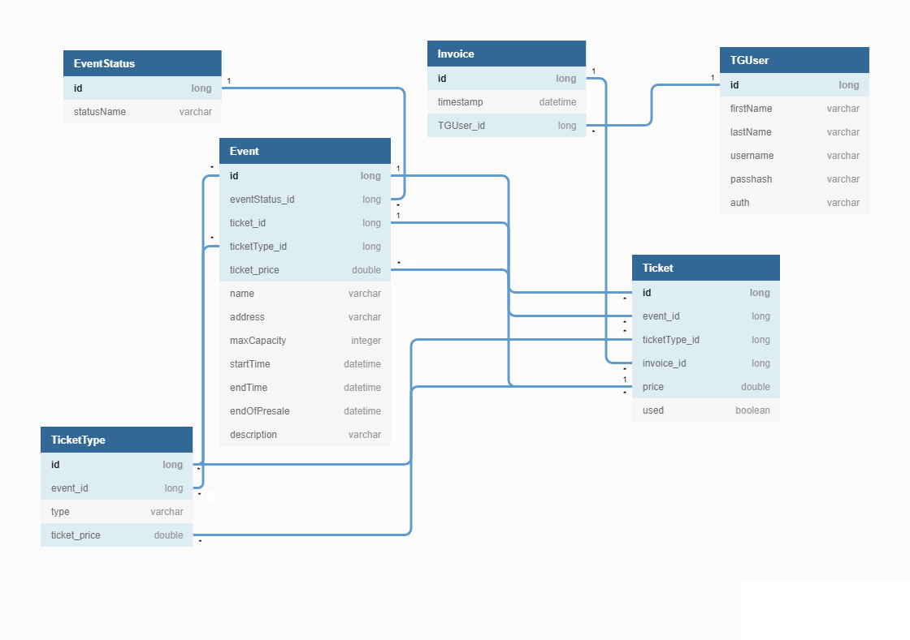
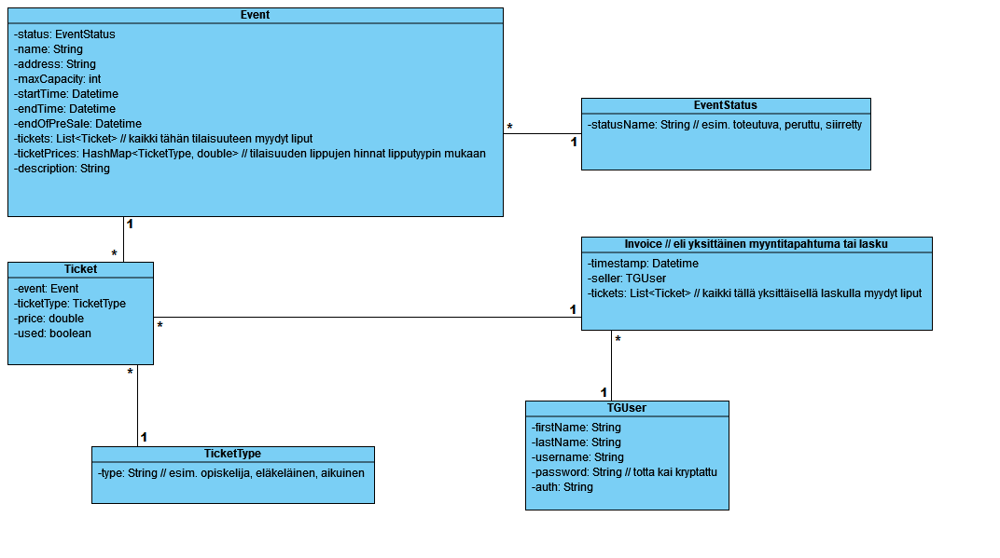

# TicketGuru

Tiimi: Max Arponen, Heta Björklund, Jerri Mäkilä, Heli Saarinen, Riitta Väisänen.

## Johdanto

Projektin aihe on TicketGuru-nimisen lipunmyyntijärjestelmän backend.

Asiakas on lipputoimisto, joka tarvitsee lipunmyyntijärjestelmän lippujen myymiseen myyntipisteessään. Lipputoimisto määrittelee tapahtumat, joihin lippuja myydään, ja montako lippua tapahtumaan voidaan myydä. Tapahtumakoordinaattori lisää tapahtumat järjestelmään ja myyjä myy lipunmyyntipisteessä lippuja asiakkaalle. Jokaisessa lipussa on yksilöllinen koodi lipuntarkastamista varten. Myöhemmässä vaiheessa järjestelmään lisätään verkkokauppa, josta asiakkaat voivat itse ostaa lippuja.

Projektin päättyessä valmiina tulee olemaan REST-rajapinta, tietokanta ja yksinkertainen käyttöliittymä. Kehittämisvaiheessa käytettävä tietokantajärjestelmä on H2, mutta lopullisessa projektissa PostgreSQL. Projekti voidaan julkaista esimerkiksi Herokussa. Lipunmyyntijärjestelmä toimii web-sovelluksena selaimella.

## Järjestelmän määrittely

Alla kuvattuna järjestelmän tarpeet tarkemmin käyttäjäroolien sekä käyttäjätarinoiden kautta.

### Käyttäjäroolit

Järjestelmällä on tässä kehitysvaiheessa kaksi roolia: myyjä sekä tapahtumakoordinaattori.

#### Myyjä

* Myy ja tulostaa lippuja asiakkaille
* Tulostaa ennakkomyynnin jälkeen jäljellä olevat liput ovella myytäviksi

#### Tapahtumakoordinaattori

* Hallinnoi tapahtumia ja lipputyyppejä 
* Lisää uusia tapahtumia ja muuttaa tapahtumien tietoja tarvittaessa

#### Tulevat roolit

Siinä vaiheessa, kun TicketGurusta lähdetään kehittämään verkkokauppaa, tarvitsemme luonnollisesti lisää rooleja, jotta toiminta olisi mahdollisimman sujuvaa.

##### Asiakas

* Asiakas tekee ostoksia lippukaupassa

##### Tapahtumajärjestäjä

* Muokkaa tapahtuman tietoja tarvittaessa
* Seuraa tapahtumiensa lipunmyyntitilannetta

### Käyttäjätarinat

#### Myyjätarinat (M)
M1 Myyjänä haluan kirjautua sisään järjestelmään, jotta voin myydä lippuja.

M2 Myyjänä haluan tietää kuinka monta lippua tapahtumassa on kokonaisuudessaan,
jotta tiedän, montako lippua voin myydä. 

M3 Myyjänä haluan tietää, mitä lipputuotteita hintoineen tapahtumaan kuuluu, 
jotta voin veloittaa asiakasta oikein. 

M4 Myyjänä haluan pystyä kuittaamaan lipun nopeasti ovella käytetyksi (lipuntarkastus), jotta jono 
etenee. 

M5 Myyjänä haluan pystyä tulostamaan ylimääräiset liput kertaheitolla ovella 
myytäväksi, jotta aikaa ei huku yksittäiseen tulosteluun. 

M6 Myyjänä haluan nähdä listauksen tulevista tapahtumista, jotta voin kertoa asiakkaalle millaisia tapahtumia on tulossa.

M7 Myyjänä haluan nähdä, onko tapahtumaan lippuja vielä myytävissä, jotta en myy "ylipaikkoja".

M8 Myyjänä haluan valita järjestelmästä useamman lipun kerralla myytäväksi, jotta jokaista lippua ei tarvitse myydä yksittäin.

M9 Myyjänä haluan saada tulostettua myymäni liput, jotta voin antaa ne asiakkaalle.

M10 Myyjänä haluan nähdä järjestelmässämme mahdolliset muutokset tapahtumista, kuten esiintyjän peruuntumisen tai hintojen muutoksen, jotta voin informoida asiakkaitani.

M11 Myyjänä haluan kyetä lisäämään usean tapahtuman lippuja myytäväksi ostoskoriin, jotta voin samalla transaktiolla myydä ne asiakkaalle. 

#### Tapahtumakoordinaattoritarinat (TK)

TK1 Tapahtumakoordinaattorina haluan kirjautua sisään järjestelmään, jotta voin lisätä tapahtumia ja lippuja.

TK2 Tapahtumakoordinaattorina haluan voida lisätä tapahtuman, jotta tapahtumaan voi lisätä lippuja myyntiin.

TK3 Tapahtumakoordinaattorina haluan voida lisätä tapahtuman lipputyypit hintoineen, jotta tapahtuman lippuja voi myydä.

TK4 Tapahtumakoordinaattorina haluan nähdä ajantasaisen raportin tapahtuman myydyistä ja 
myymättömättömistä lipuista, jotta voin seurata myynnin etenemistä. 

TK5 Tapahtumakoordinaattorina haluan nähdä listauksen kaikista tapahtumista haluamaltani aikaväliltä, jotta tiedän, miten paljon töitä myyjillä on.

TK6 Tapahtumakoordinaattorina haluan kyetä tekemään muutoksia tapahtumiin, jotta ohjelmassa oleva tieto ja tuotteet ovat ajantasaisia

TK7 Tapahtumakoordinaattorina haluan voida perua tapahtuman esimerkiksi esiintyjän peruessa.

TK8 Tapahtumakoordinaattorina haluan saada listauksen peruttuun tapahtumaan myydyistä lipuista, jotta tiedän mitkä liput on hyvitettävä asiakkaille.

TK9 Tapahtumakoordinaattorina haluan voida muuttaa tapahtuman lippujen hintoja lisäämällä mahdollisia alennuksia ja kampanjatarjouksia.

TK10 Tapahtumakoordinaattorina haluan kyetä ottamaan vapaana olevia lippuja pois myynnistä, voidakseni toimia mm. koronasäädösten tai tapahtuman ylläpitäjän toiveiden mukaan.

## Käyttöliittymä

### Käyttöliittymäkaavio

## Tietokanta

### Tietokantakaavio

### Tietohakemisto

> ### _Ticket_
> _Ticket-taulu sisältää lipun tiedot._
>
> Kenttä | Tyyppi | Kuvaus
> ------ | ------ | ------
> id | long PK | Ticket id
> event_id | long FK |  Tapahtuman tunnus, viittaus [Event](#Event)-tauluun
> ticketType_id | long FK | Lipputyypin tunnus, viittaus [TicketType](#TicketType)-tauluun
> price | double | Lipun hinta 
> used | boolean | Lipun status, onko lippu käytetty vai ei

> ### _Event_
> _Event-taulu sisältää tapahtuman tiedot._
>
> Kenttä | Tyyppi | Kuvaus
> ------ | ------ | ------
> id | long PK | Event id
> eventStatus_id | long | Tapahtuman status, viittaus [EventStatus](#EventStatus)-tauluun
> ticket_id | long | Tapahtumaan kuuluvat liput, viittaus [Ticket](#Ticket)-tauluun
> ticketType_id | long | Tapahtumaan saatavilla olevat lipputyypit, viittaus [TicketType](#TicketType)-tauluun
> ticket_price | double | Tapahtuman lippujen hinnat, viittaus hintaan [Ticket](#Ticket)-taulussa
> name | varchar | Tapahtuman nimi
> address | varchar | Tapahtumapaikan osoite
> maxCapacity | int | Tapahtuman maksimipaikkamäärä
> startTime | DateTime | Tapahtuman alkuaika (pvm ja kellonaika)
> endTime | DateTime | Tapahtuman loppuaika (pvm ja kellonaika)
> endOfPresale | DateTime | Tapahtuman ennakkomyynnin loppu (pvm ja kellonaika)
> description | varchar | Lyhyt kuvaus tapahtumasta ja sen esiintyjistä

> ### _EventStatus_
> _EventStatus-taulu sisältää tapahtuman statuksen: onko se toteutuva, peruttu tai siirretty._
>
> Kenttä | Tyyppi | Kuvaus
> ------ | ------ | ------
> id | long PK | EventStatus id
> statusName | varchar | Tapahtuman status

>### _Invoice_
>_Invoice-taulu käsittää yksittäisen myyntitapahtuman. Jokaisella myyntitapahtumalla (invoice) on aina vain yksi myyjä (TGUser). Jokaisella myyntitapahtumalla voi olla useampi lippu (ticket)._
>
>Kenttä | Tyyppi | Kuvaus
>------ | ------ | ------
>id | long PK | Laskun id
>timeOfSale | DateTime | Myyntitapahtuman aikamerkintä
>TGUser_id | long FK | Laskun kirjoittanut myyjä, viittaus käyttäjään [TGUser](#TGUser)-taulussa
>ticket_id | long FK | Laskun sisältämät liput, viittaus lippuun [Tickets](#Ticket)-tauluun

>### _TGUser_
>_TGUser-taulu kuvaa yksittäistä myyjää. Myyjä liittyy useampaan myyntitapahtumaan (invoice)._
>
>Kenttä | Tyyppi | Kuvaus
>------ | ------ | ------
>TGUser_id | long PK | Käyttäjän id
>firstName | varchar | Etunimi
>lastnName | varchar | Sukunimi
>userName | varchar | Käyttäjänimi
>password | varchar | Suolattu salasana
>auth | varchar | Käyttöoikeustaso

>### _TicketType_
>_TicketType-taulu kuvastaa lipun tyyppiä. Lipputyypit määritetään kullekkin tapahtumalle erikseen, ja kullekkin lipputyypille määritetään oma hinta._
>
>Kenttä | Tyyppi | Kuvaus
>------ | ------ | ------
>tickettype_id | long PK | Lipputyypin id
>event_id | long | tapahtuman tunnus, viittaus tapahtumaan [Event](#Event)-taulussa
>type | varchar | tarkempi kuvaus lipun tyypistä
>ticket_price | double | lipun hinta

### Luokkakaavio

## Tekninen kuvaus

Teknisessä kuvauksessa esitetään järjestelmän toteutuksen suunnittelussa tehdyt tekniset
ratkaisut, esim.

-   Missä mikäkin järjestelmän komponentti ajetaan (tietokone, palvelinohjelma)
    ja komponenttien väliset yhteydet (vaikkapa tähän tyyliin:
    https://security.ufl.edu/it-workers/risk-assessment/creating-an-information-systemdata-flow-diagram/)
-   Palvelintoteutuksen yleiskuvaus: teknologiat, deployment-ratkaisut yms.
-   Keskeisten rajapintojen kuvaukset, esimerkit REST-rajapinta. Tarvittaessa voidaan rajapinnan käyttöä täsmentää
    UML-sekvenssikaavioilla.
-   Toteutuksen yleisiä ratkaisuja, esim. turvallisuus.

Tämän lisäksi

-   ohjelmakoodin tulee olla kommentoitua
-   luokkien, metodien ja muuttujien tulee olla kuvaavasti nimettyjä ja noudattaa
    johdonmukaisia nimeämiskäytäntöjä
-   ohjelmiston pitää olla organisoitu komponentteihin niin, että turhalta toistolta
    vältytään

## Testaus

Tässä kohdin selvitetään, miten ohjelmiston oikea toiminta varmistetaan
testaamalla projektin aikana: millaisia testauksia tehdään ja missä vaiheessa.
Testauksen tarkemmat sisällöt ja testisuoritusten tulosten raportit kirjataan
erillisiin dokumentteihin.

Tänne kirjataan myös lopuksi järjestelmän tunnetut ongelmat, joita ei ole korjattu.

## Asennustiedot

Järjestelmän asennus on syytä dokumentoida kahdesta näkökulmasta:

-   järjestelmän kehitysympäristö: miten järjestelmän kehitysympäristön saisi
    rakennettua johonkin toiseen koneeseen

-   järjestelmän asentaminen tuotantoympäristöön: miten järjestelmän saisi
    asennettua johonkin uuteen ympäristöön.

Asennusohjeesta tulisi ainakin käydä ilmi, miten käytettävä tietokanta ja
käyttäjät tulee ohjelmistoa asentaessa määritellä (käytettävä tietokanta,
käyttäjätunnus, salasana, tietokannan luonti yms.).

## Käynnistys- ja käyttöohje

Tyypillisesti tässä riittää kertoa ohjelman käynnistykseen tarvittava URL sekä
mahdolliset kirjautumiseen tarvittavat tunnukset. Jos järjestelmän
käynnistämiseen tai käyttöön liittyy joitain muita toimenpiteitä tai toimintajärjestykseen liittyviä asioita, nekin kerrotaan tässä yhteydessä.

Usko tai älä, tulet tarvitsemaan tätä itsekin, kun tauon jälkeen palaat
järjestelmän pariin !
